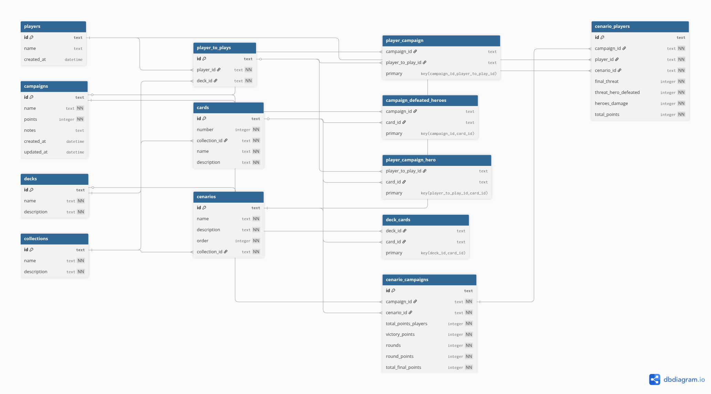

# Senhor dos Aneis Card Game

Um app para registro de campanha

Todo trabalho foi desenvolvido em live no canal [Téo Me Why](https://twitch.tv/teomewhy).

> [!WARNING]
> Finalidade apenas de aprendizado e uso pessoal.

## Setup

Há dois componentes nessa aplicação. E agora você pode rodá-los com docker!

### Backend

Nosso backend foi feito em GoLang.

### Frontend

O frontend foi construido em python com a biblioteca `Streamlit`.

### Execução

Basta utilizar docker-compose para executar ambos componentes:

```bash
docker-compose up --build -d
```

## Schema

O schema de banco de dados foi desenhado a partir das entidades identificadas na documentação do `Livro de Regras Base` para preenchimento da ficha de Registro de Capanha.

